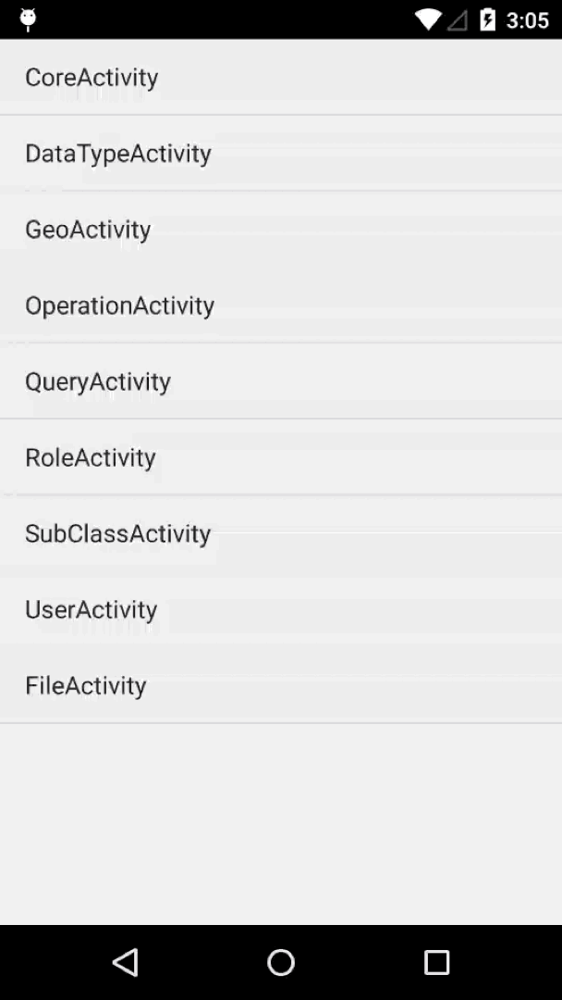

# MaxLeap-Demo-CloudData-Android

## Overview

CloudData is a sample of MaxLeap SDK, and it relies on the basic module of MaxLeap. This app shows the CloudData operations based on MaxLeap SDK.

The project is composed with multiple pages and each page will show the relative basic operations of that module, like general data storage, checking clause usage, file upload&download, etc.

## Effect

## How to Use

1. Open Android Studio or IDEA, click `File -> Open `, select and import `setting.gradle`.
2. Open `App.java` and replace the defined constants with your own `APP Id` and `API KEY`.